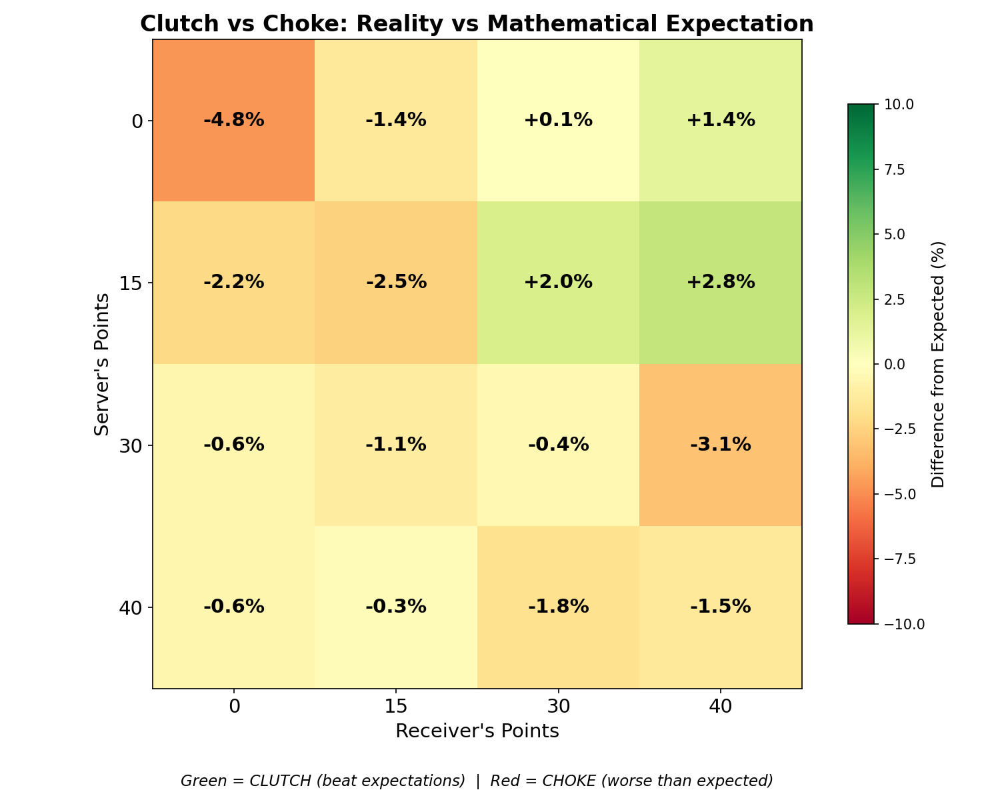
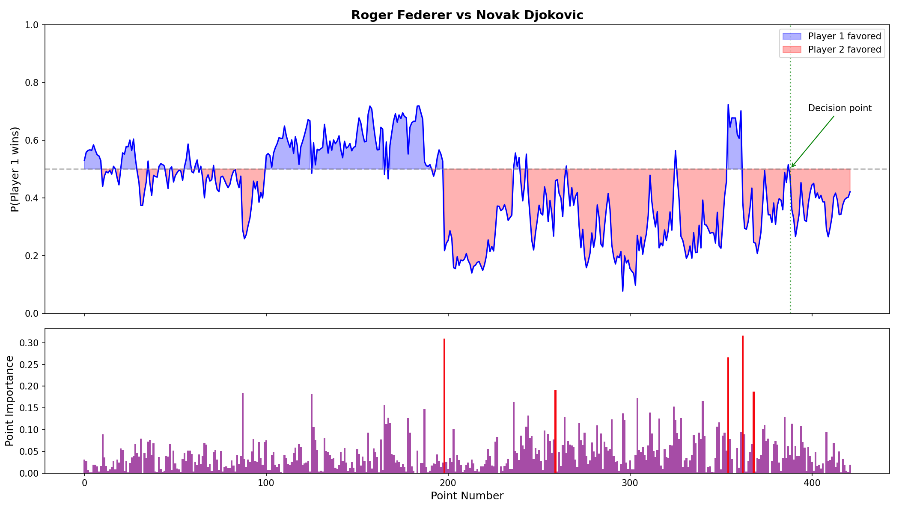

# Tennis Point Leverage Analysis

A machine learning approach to quantifying point-level pressure in professional tennis. This project uses LSTM neural networks trained on 170,000 service games to measure how players perform under pressure compared to mathematical expectation.

## Overview

Tennis scoring creates unequal point importance. While conventional wisdom suggests players "choke" under pressure, the data reveals a more nuanced story: players significantly outperform mathematical expectation when facing break points but underperform when ahead.

This project compares empirical hold probabilities (learned by an LSTM) against theoretical baselines (computed from independence assumptions) to isolate psychological effects.

## Key Findings

- Players outperform expectation by 2-5% when under pressure (facing break points)
- Players underperform by 1-5% when comfortable (holding serve comfortably)
- The first point of a service game has disproportionate impact: +25.6% hold rate difference
- 30-30 is the highest-leverage non-terminal point with 43% swing in hold probability
- Small but measurable momentum effect exists: +2.4% win probability after winning previous point

## Results

### Point Leverage

Point leverage measures the swing in hold probability from winning vs. losing a point. Higher leverage indicates more critical points.


### Clutch vs. Choke

Performance deviation compares empirical hold probabilities against theoretical expectation. Positive values indicate clutch performance, negative values indicate underperformance.



### Match Prediction

The model provides real-time hold probability predictions as a match progresses, capturing momentum and psychological factors.



## Installation

### Requirements

- Python 3.8 or higher
- pip

### Setup

Clone the repository:

```bash
git clone https://github.com/elementnl/tennis-point-model.git
cd tennis-point-model
```

Create and activate a virtual environment:

```bash
python -m venv .venv
source .venv/bin/activate  # On Windows: .venv\Scripts\activate
```

Install dependencies:

```bash
pip install -r requirements.txt
```

## Usage

### Training the Model

```bash
python src/train.py
```

### Analyzing Point Leverage

```bash
python src/importance.py
```

### Processing Match Data

```bash
python src/data.py
```

## Model Architecture

- 2-layer LSTM with 32 hidden dimensions
- Input: Point-by-point score sequences (server points, receiver points, point outcome)
- Output: Probability that server holds the game
- Training: 135,876 games, Validation: 33,970 games
- Final validation accuracy: 99.2%
- Total parameters: ~6,000

The model is intentionally small to learn generalizable patterns rather than memorize specific matches.

## Data Source

This project uses data from the [Tennis Abstract Match Charting Project](https://github.com/JeffSackmann/tennis_MatchChartingProject) by Jeff Sackmann. The dataset contains point-by-point data for professional tennis matches.

## Tools and Technologies

- PyTorch: Deep learning framework for LSTM implementation
- NumPy: Numerical computation
- Pandas: Data processing and analysis
- Matplotlib: Visualization
- Scikit-learn: Model evaluation metrics
- Jupyter: Interactive development and analysis

## Project Structure

```
tennis-point-model/
├── src/
│   ├── data.py          # Data loading and preprocessing
│   ├── dataset.py       # PyTorch dataset implementation
│   ├── model.py         # LSTM model architecture
│   ├── train.py         # Training loop
│   ├── game_model.py    # Game probability calculations
│   └── importance.py    # Point leverage analysis
├── figures/             # Generated visualizations
├── models/              # Saved model checkpoints
├── data/                # Raw data files
└── requirements.txt     # Python dependencies
```

## License

This project is licensed under the MIT License - see the LICENSE file for details.

## Citation

If you use this code or methodology in your research, please cite:

```
@misc{tennis-point-leverage,
  author = {Varun},
  title = {Quantifying Point Leverage in Tennis: An LSTM Approach},
  year = {2024},
  publisher = {GitHub},
  url = {https://github.com/elementnl/tennis-point-model}
}
```

## Acknowledgments

Data provided by Jeff Sackmann's [Tennis Abstract Match Charting Project](https://github.com/JeffSackmann/tennis_MatchChartingProject).
